# 🗂️ copilot-workspaces

[](https://www.npmjs.com/package/copilot-workspaces)
[](https://www.npmjs.com/package/copilot-workspaces)
[](LICENSE)
[](https://nodejs.org)

> Group your **Copilot CLI sessions** into named workspaces — one per customer, project, or initiative — and resume any of them with a sentence.

`copilot-workspaces` is an [MCP](https://modelcontextprotocol.io) server that adds a small, focused set of natural-language tools to the [GitHub Copilot CLI](https://github.com/github/copilot-cli). It uses Copilot's own session store as a read-only source of truth and adds a tiny private SQLite database alongside it for your workspace mappings.

You speak. The agent picks the right tool. The result is a markdown table.

---

## 🎬 In action

<p align="center">
  
</p>

You never type a tool name. You never remember a session ID. You describe what you want, and the agent picks the right tool.

---

## 🧠 Why this exists

Copilot CLI keeps an excellent session store — every conversation is durable, auto-titled, checkpointed, and resumable. But once you have **dozens** of sessions across **multiple customers**, finding "the JWT bug from Contoso last Tuesday" is a needle in a haystack.

This plugin adds a single missing concept — **workspaces** — and lets you reach for them conversationally from any session, in any repo, on any branch.

```
   ┌──────────────────────┐
   │  Copilot CLI session │
   │  (what you're in)    │
   └──────────┬───────────┘
              │
              │  "show me my Contoso workspace"
              ▼
   ┌──────────────────────┐
   │  copilot-workspaces  │  ← MCP server (this repo)
   │  • workspaces.db     │     ~\.copilot\workspaces.db
   │  • read session-store│     ~\.copilot\session-store.db (read-only)
   └──────────┬───────────┘
              │
              ▼
   ┌──────────────────────┐
   │  Markdown table back │
   │  to the chat         │
   └──────────────────────┘
```

---

## 🧰 Tools

All tools are invoked **for** you by the agent based on natural language. You don't need to memorise them — but here's the full surface area.

| Tool                  | Speak it like…                                              | What it does                                                                 |
|-----------------------|-------------------------------------------------------------|------------------------------------------------------------------------------|
| `workspaces_list`     | *"what workspaces do I have"*, *"list my workspaces"*        | Shows every workspace with session counts and last activity timestamp        |
| `workspaces_create`   | *"create a workspace for Contoso"*                          | Creates an empty workspace with the given name (free text, case-insensitive) |
| `workspaces_delete`   | *"delete the Contoso workspace"*                            | Removes the workspace itself; underlying sessions are untouched              |
| `workspaces_show`     | *"show me Contoso"*, *"what's in Northwind"*                | Markdown table of every session in a workspace                               |
| `workspaces_assign`   | *"add this session to Contoso"*, *"tag this as Northwind"*  | Adds the current (or a specific) session to a workspace                      |
| `workspaces_unassign` | *"remove session ab12cd3 from Contoso"*                     | Removes one session from a workspace; the workspace remains                  |
| `workspaces_resume`   | *"resume that one"*, *"open ab12cd3 from Contoso"*          | Returns the `/resume <id>` command to run                                    |
| `workspaces_prune`    | *"clean up Contoso"*, *"prune dead sessions"*               | Removes mappings whose underlying sessions no longer exist                   |

---

## 📐 Design choices worth knowing

- **Two databases, one purpose.** Reads come from Copilot's own `~/.copilot/session-store.db` (read-only, never modified). Writes go to a private `~/.copilot/workspaces.db` we own. If this plugin ever vanishes, your Copilot data is unaffected.
- **Names are free text.** `Contoso`, `Northwind Migration`, `internal/tooling`, `🎯 Q2 OKRs` — anything goes. Lookup is case-insensitive and Unicode-normalised.
- **One session, many workspaces.** A session that's both *Contoso* and *Auth bugs* lives in both — no duplication.
- **No name leakage in summaries.** Sessions without a generated title fall back to `(unnamed <short-id>)`, never to the user's first prompt (which could contain sensitive context).
- **Stale data shows up.** If a session you assigned has since been deleted from Copilot's store, it appears as `~~(unnamed)~~ *(missing)*` — `workspaces_prune` cleans these up on demand.
- **Resume is a command, not a context switch.** The MCP layer doesn't allow swapping the host process. So `workspaces_resume` returns the exact `/resume <id>` you can paste — one keystroke away.
- **Concurrency-safe.** Workspaces DB uses WAL mode + 5s busy timeout + foreign-key enforcement. Multiple Copilot sessions can read/write at the same time without corruption.

---

## 🚀 Install

### Prerequisites

| Requirement      | Version     | Why                                  |
|------------------|-------------|--------------------------------------|
| **Node.js**      | ≥ 22.0.0    | Built-in `node:sqlite`, no native deps to compile |
| **Copilot CLI**  | ≥ 1.0.36    | MCP plugin support                   |

### One step

Add this block to `~/.copilot/mcp-config.json` (create the file if it doesn't exist):

```json
{
  "mcpServers": {
    "copilot-workspaces": {
      "command": "npx",
      "args": ["-y", "copilot-workspaces"]
    }
  }
}
```

Then, from inside any Copilot CLI session:

```text
/mcp reload
```

That's it. No clone, no `cd`, no absolute paths. `npx` will fetch the package on first use and cache it.

> **Want to pin a version?** Use `["-y", "copilot-workspaces@0.1.0"]`. To upgrade later, change the version (or drop the pin) and `/mcp reload`.

---

## 🔒 What this plugin can see and do

`copilot-workspaces` runs locally as an MCP server on your machine. It is intentionally narrow:

- **Reads** `~/.copilot/session-store.db` (read-only) — your existing Copilot CLI session metadata: session IDs, auto-generated summaries, checkpoint titles, last-active timestamps, and the working directory each session was run in.
- **Writes** `~/.copilot/workspaces.db` — a small SQLite database it owns, containing only workspace names you chose and the session IDs you assigned to them.
- **Never** makes network requests. No telemetry, no update checks, nothing leaves your machine.
- **Never** executes shell commands. The `resume` tool returns a `/resume <id>` command as text for *you* to run.
- **Never** touches files outside `~/.copilot/`.
- **Cannot** corrupt your Copilot history — the session store is opened read-only.

When you call a workspace tool, the **tool's response** (workspace names, session summaries, checkpoint titles, `cwd` paths, timestamps) is returned to the Copilot CLI agent — same trust boundary as anything else Copilot already sees about your sessions. No new data leaves your machine; the plugin just makes existing local data browsable.

Source: [`server.mjs`](./server.mjs) (~500 lines, one file). Audit it yourself before installing.

---

## 🧪 Verify it's working

From inside any Copilot session:

```text
You ▸ create a workspace called Smoke Test
🤖 ▸ ✅ Created workspace Smoke Test.

You ▸ add this session to Smoke Test
🤖 ▸ ✅ Assigned session <short-id> to Smoke Test.

You ▸ show me Smoke Test
🤖 ▸ <table with one row, your current session>

You ▸ delete the Smoke Test workspace
🤖 ▸ 🗑️ Deleted workspace Smoke Test. Sessions themselves are untouched.
```

---

## 🤝 Sharing & privacy

**The plugin is portable. Your data is not.**

- Anyone can install the plugin with the `npx` snippet above. They get the *capability* — empty workspaces.
- Your `~/.copilot/workspaces.db` lives only on your machine. It's not synced, not uploaded, not shared.
- Copilot's session-store is opened read-only by this plugin. Nothing about your existing sessions changes.

---

## 🔧 Configuration (optional)

There's nothing to configure. The defaults are:

| Path                           | Purpose                                  |
|--------------------------------|------------------------------------------|
| `~/.copilot/workspaces.db`     | Your private workspaces (writeable)      |
| `~/.copilot/session-store.db`  | Copilot's session history (read-only)    |

Both are auto-discovered relative to your home directory.

---

## 🐛 Troubleshooting

<details>
<summary><strong>Tool calls fail with "Could not read host session-store.db"</strong></summary>

Your Copilot CLI version may not have created `~/.copilot/session-store.db` yet. Open Copilot CLI once, send any message, exit, and try again. The file is created on first use.

</details>

<details>
<summary><strong>"Host session-store.db is missing expected columns"</strong></summary>

Copilot CLI's session schema changed in a way this plugin doesn't yet handle. Open an issue with your Copilot CLI version (`copilot --version`) — schema-tolerance fixes are quick to ship.

</details>

<details>
<summary><strong>I see a yellow `ExperimentalWarning: SQLite is an experimental feature` line</strong></summary>

That's Node 22's built-in SQLite warning — it's harmless and emitted to stderr only. No action needed.

</details>

<details>
<summary><strong>The agent picks the wrong tool sometimes</strong></summary>

Be more explicit. *"remove a session from Contoso"* (unassign) vs *"delete the Contoso workspace"* (delete) are clearer than *"remove Contoso"*. The descriptions are tuned, but the agent occasionally needs a nudge.

</details>

---

## 📝 License

MIT — see [LICENSE](./LICENSE).

---

<p align="center"><sub>Built because <code>~/.copilot/session-store.db</code> deserves friends.</sub></p>
